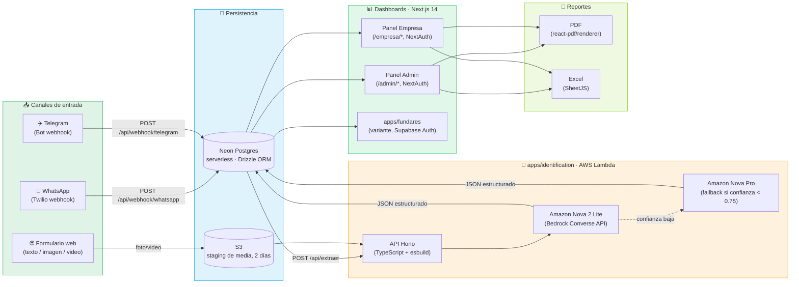
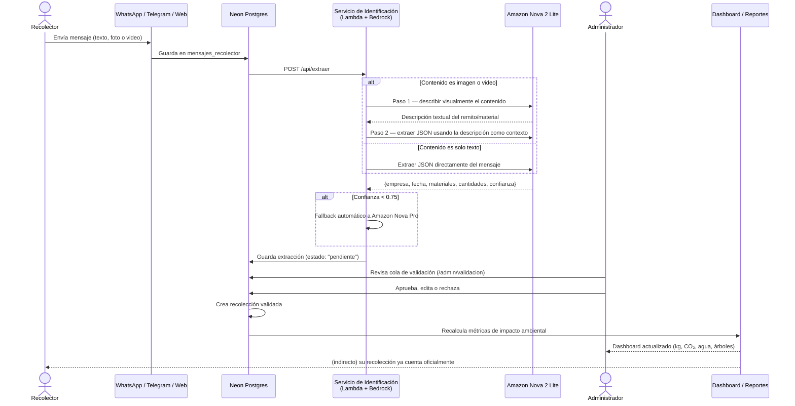
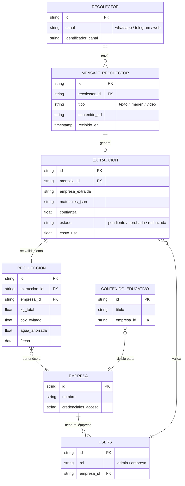
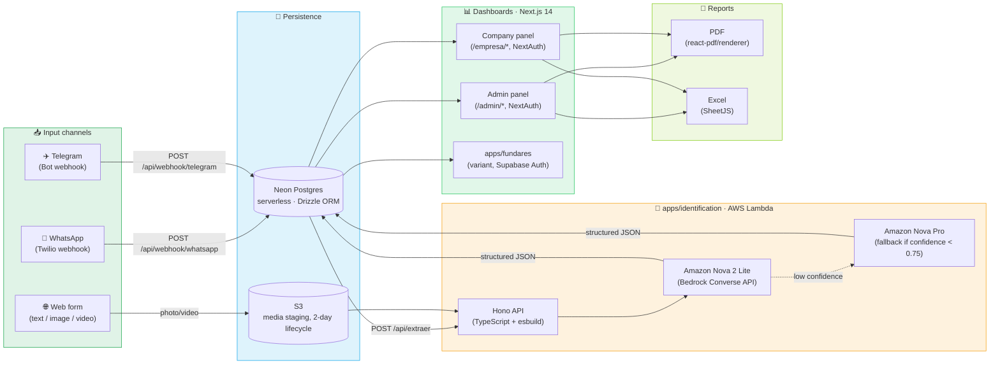
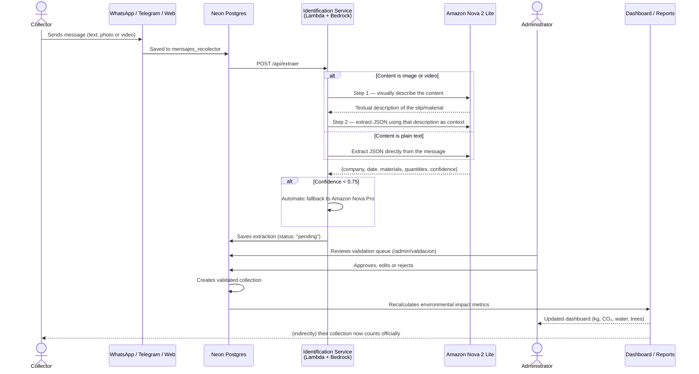
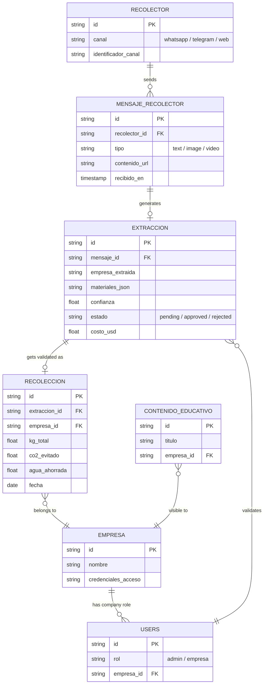

  

  

  
  
  
  
  
  
  
  
  

  

  <a href="#español"><b>🇪🇸 Español</b></a> &nbsp;·&nbsp; <a href="#english"><b>🇬🇧 English</b></a>

---

## 🇪🇸 Español

### 📑 Tabla de contenidos

- [¿Qué es Fundares?](#qué-es-fundares)
- [Arquitectura](#arquitectura)
- [Flujo de extracción con IA](#flujo-de-extracción-con-ia)
- [Modelo de datos](#modelo-de-datos)
- [Características principales](#características-principales)
- [Stack tecnológico](#stack-tecnológico)
- [Estructura del proyecto](#estructura-del-proyecto)
- [CI/CD y automatización](#cicd-y-automatización)
- [Seguridad y aislamiento de datos](#seguridad-y-aislamiento-de-datos)
- [Estado del proyecto y roadmap](#estado-del-proyecto-y-roadmap)
- [Licencia](#licencia)
- [Autor y contacto](#autor-y-contacto)

---

### ¿Qué es Fundares?

**Fundares** es la plataforma digital construida para la **Fundación para el Reciclaje, Santa Cruz (Bolivia)**. Resuelve un problema muy concreto y muy humano: los recolectores de materiales reciclables — personas que recorren la ciudad juntando cartón, plástico, vidrio y metal — reportaban sus entregas por **WhatsApp o Telegram** con mensajes de texto informales, fotos borrosas de remitos y videos de los materiales. Ese flujo se procesaba a mano en hojas de cálculo: datos incompletos, errores de tipeo, cero trazabilidad y ninguna forma de mostrarle a nadie el impacto ambiental real de todo ese trabajo.

Fundares automatiza el ciclo completo, de punta a punta: desde el mensaje crudo del recolector hasta un reporte validado por un humano, con el impacto ambiental ya calculado — kilos reciclados, CO₂ evitado, agua ahorrada, árboles equivalentes — listo para mostrarse en un dashboard o exportarse como PDF/Excel certificado.

**¿Para quién es?**

| Rol | Qué hace en la plataforma |
|---|---|
| 🚴 **Recolector** | Envía su reporte por el canal que ya usa a diario — WhatsApp, Telegram o un formulario web — sin curva de aprendizaje ni instalar nada nuevo. |
| 🛡️ **Administrador de la fundación** | Valida cada extracción de IA antes de que cuente como oficial, da de alta empresas aliadas, monitorea los tres canales en tiempo real y emite reportes. |
| 🏢 **Empresa aliada** | Consulta en vivo su propio impacto ambiental y descarga reportes certificados (PDF/Excel) para sus informes de sostenibilidad corporativa. |

> **Sobre el origen del repositorio (nota de portfolio):** el `package.json` raíz aún conserva el nombre histórico `decouple-services`, y `CHANGELOG.md`/`CODEOWNERS` apuntan a un origen previo (`walteribanez555/decouple-services`) centrado en un servicio de **verificación de identidad/edad** — con flujo de documentos y una app móvil en Flutter. El código que vive hoy en `jackson1939/aram` fue **reorientado por completo** hacia el dominio de gestión de reciclaje descrito arriba: no queda ninguna app móvil en el árbol de trabajo actual (`apps/mobile` no existe), y el servicio que antes leía documentos de identidad ahora extrae datos de recolección de materiales. Es, en los hechos, un **pivot de producto** completo sobre una base de infraestructura ya madura (Lambda + Bedrock + CDK + CI/CD), reaprovechada para un dominio totalmente distinto.

---

### Arquitectura

Fundares combina tres canales de entrada, un servicio serverless de extracción con IA generativa y dos dashboards Next.js que sirven roles distintos, todo sobre una base de datos serverless compartida.

> **Infraestructura como código:** todo lo que ves dentro de `IA` (API Gateway HTTP v2 + Lambda + Secrets Manager + IAM + CloudWatch) está definido con **AWS CDK v2** en `infra/`, con *validation aspects* propios (`SecurityValidationAspect`, `CostOptimizationAspect`) que corren en cada `synth`/`deploy` para bloquear configuraciones inseguras o costosas antes de que lleguen a producción.

---

### Flujo de extracción con IA

El corazón técnico del producto es cómo convierte un mensaje ambiguo de WhatsApp en un dato estructurado y confiable. Así se ve una recolección real de principio a fin:

**Detalles que hacen la diferencia:**

- **Flujo two-step para imagen/video** — primero se pide al modelo una descripción visual libre, y esa descripción se reinyecta como contexto para la segunda llamada de extracción estructurada. Esto mejora notablemente la precisión en remitos parciales, fotos sin documento visible o materiales fotografiados sin ningún papel de respaldo.
- **Videos** (MP4, MOV, AVI, MKV, WebM, máx. 2 minutos) se referencian siempre por URI de S3 — nunca se envían en base64 al modelo.
- **Niveles de confianza explícitos:** `high` (≥ 0.75), `medium` (0.45–0.74), `low` (< 0.45, siempre devuelve `extracted: null`).
- **Cero alucinación por diseño:** si un campo no es visible o inferible con certeza, la respuesta es `null` — nunca un valor inventado por el modelo.
- **Costo por extracción** calculado y devuelto en cada respuesta (`usage.costUsd`), a partir del uso real de tokens.
- IAM ya está aprovisionado (aunque sin uso actual en el flujo) para invocar Claude Haiku 4 y Sonnet 4 vía Bedrock, dejando la puerta abierta a comparar modelos sin tocar infraestructura.

---

### Modelo de datos

El núcleo del negocio gira en torno a la ficha de cliente/recolector y su historial de recolecciones, con acceso SQL directo vía Drizzle (sin capas de ORM pesadas):

> Esquema simplificado a partir de `packages/db/schema.ts` y `db/neon.schema.sql`. Las tablas reales incluyen además `recolectores` y `conversaciones` como soporte de estado por canal (para sostener contexto conversacional en WhatsApp/Telegram entre mensajes).

---

### Características principales

#### 📥 Canales de entrada (3 activos)

| Canal | Mecanismo |
|---|---|
| WhatsApp | Webhook de Twilio — `POST /api/webhook/whatsapp` |
| Telegram | Webhook de Bot — `POST /api/webhook/telegram` |
| Web | Formulario en el dashboard (texto, imagen o video) |

#### 🧠 Extracción con IA (`apps/identification`)

- Servicio serverless en AWS Lambda que analiza texto, imagen o video y devuelve JSON estructurado: empresa, fecha, materiales, cantidades y nivel de confianza.
- **Modelo primario:** Amazon Nova 2 Lite (`global.amazon.nova-2-lite-v1:0`) vía Bedrock Converse API, con ventana de contexto de 1M de tokens.
- **Fallback automático** a Amazon Nova Pro cuando la confianza cae por debajo de `CONFIDENCE_THRESHOLD` (0.75 por defecto).
- **Flujo two-step** para imagen/video, descrito en detalle en la sección anterior.
- Cálculo de costo por extracción incluido en cada respuesta, basado en tokens reales consumidos.
- IAM ya habilitado para modelos Claude Haiku 4 y Sonnet 4 vía Bedrock, sin uso actual en el flujo de producción.

#### 📊 Dashboard web (`apps/web`) — dos roles diferenciados

**Panel Admin (`/admin/*`):**
- Métricas globales en tiempo real (kg reciclados, CO₂ evitado, agua ahorrada, árboles equivalentes) con gráficos por material y por canal.
- Cola de validación con calendario mensual — aprobar, editar o rechazar cada extracción con un clic.
- Alta y gestión de empresas aliadas, incluida la generación de sus credenciales de acceso.
- Reportes PDF y Excel filtrados por empresa, año, mes o rango de fechas, o consolidado global.
- Monitoreo de canales en tiempo real: mensajes recibidos, estados de extracción, usuarios únicos, kg totales.
- Contenido educativo y guías interactivas con tours (`intro.js`).

**Panel Empresa (`/empresa/*`):**
- Impacto ambiental propio con gráficos de evolución mensual y por material, refrescado cada 30 segundos.
- Reportes propios en PDF y Excel con filtros de fecha.
- Formulario de nueva recolección (texto, imagen o video) con paso de revisión antes de guardar.

#### 📄 Reportes

- **PDF** (`@react-pdf/renderer`): encabezado, métricas de impacto, tabla por material, tabla por mes y tabla por empresa (en el reporte global).
- **Excel** (SheetJS `xlsx`): hojas de Resumen, Por Material, Por Mes, Por Empresa y Detalle completo.

---

### Stack tecnológico

| Capa | Tecnología | Rol |
|---|---|---|
| 🧠 Extracción IA | AWS Bedrock — Amazon Nova 2 Lite (primario) + Nova Pro (fallback) | Convierte texto/imagen/video en JSON estructurado |
| ⚙️ API serverless | [Hono](https://hono.dev/) `^4.6` · Node.js 22 · TypeScript · esbuild | Handler Lambda del servicio de identificación |
| 📊 Dashboard | Next.js `14.2` (App Router) · React `18.3` · TypeScript · Tailwind CSS `3.4` | Paneles admin y empresa |
| 🗄️ ORM / Base de datos | Drizzle ORM `^0.38` · Neon Postgres (serverless) | Persistencia de mensajes, extracciones y recolecciones |
| 🔑 Auth | NextAuth.js `^4.24` (JWT, roles) en `apps/web` · Supabase Auth en `apps/fundares` | Sesión y control de acceso por rol |
| 📄 Reportes | `@react-pdf/renderer` (PDF) · SheetJS `xlsx` (Excel) | Generación de reportes certificados |
| 📈 Gráficos | Recharts | Visualización de métricas de impacto |
| 🎓 Tours interactivos | intro.js | Onboarding guiado dentro del dashboard |
| 🔔 Notificaciones UI | react-hot-toast | Feedback de acciones en el dashboard |
| 🖼️ Storage de media | S3 (staging temporal, 2 días) · Vercel Blob (fotos permanentes) | Ciclo de vida de imágenes y videos |
| 💬 Mensajería | Twilio (WhatsApp) · Telegram Bot API | Canales de entrada |
| ☁️ Infraestructura como código | AWS CDK v2 (TypeScript) · API Gateway HTTP v2 · Lambda · Secrets Manager · CloudWatch | Despliegue reproducible y auditable |
| 📦 Monorepo | Turborepo `^2.9` · npm workspaces (`npm@11.6.1`) | Orquestación de builds entre apps y packages |
| 🔁 CI/CD | GitHub Actions (3 workflows) | Deploys automáticos, releases y rollback |
| ✅ Testing | Jest / ts-jest | `apps/identification`, `infra` |

---

### Estructura del proyecto

```mermaid
graph TD
    Root["aram/"] --> Apps["apps/"]
    Root --> Packages["packages/"]
    Root --> Infra["infra/"]
    Root --> DbDir["db/"]
    Root --> Docs["docs/"]
    Root --> Scripts["scripts/"]
    Root --> Supabase["supabase/"]
    Root --> Workflows[".github/workflows/"]

    Apps --> Identification["identification/<br/>servicio IA · Lambda serverless"]
    Apps --> Web["web/<br/>dashboard principal · NextAuth"]
    Apps --> FundaresApp["fundares/<br/>variante paralela · Supabase Auth · puerto 3001"]

    Identification --> IdxTs["src/index.ts · handler Lambda"]
    Identification --> AppTs["src/app.ts · app Hono"]
    Identification --> Adapters["src/common/adapters/bedrock/<br/>Nova + Claude"]
    Identification --> Modules["src/modules/identification/<br/>controller, service, DTOs, pricing"]

    Packages --> DbPkg["db/ · schema Drizzle<br/>@fundares/db"]
    Packages --> AuthPkg["auth/ · config NextAuth<br/>@fundares/auth"]
    Packages --> Types["shared-types/<br/>tipos de dominio compartidos"]

    Infra --> Stacks["stacks CDK v2<br/>FundaresStack-Prod / SharedStack"]
    Infra --> Aspects["validation aspects<br/>Security · CostOptimization"]

    DbDir --> Schema["neon.schema.sql"]
    DbDir --> Migration["telegram.migration.sql"]

    Workflows --> Cicd["cicd.yml"]
    Workflows --> Release["production-release.yml"]
    Workflows --> Rollback["rollback.yml"]

    style Root fill:#1B5E2033,stroke:#1B5E20
    style Apps fill:#16a34a22,stroke:#16a34a
    style Packages fill:#0ea5e922,stroke:#0ea5e9
    style Infra fill:#f59e0b22,stroke:#f59e0b
    style Workflows fill:#84cc1622,stroke:#84cc16
```

**Qué hace cada parte:**

- **`apps/identification`** — el núcleo de IA. Recibe texto/imagen/video, llama a Bedrock y devuelve datos estructurados. Se compila a un único bundle con esbuild y corre como función Lambda detrás de API Gateway. Estructura interna: `src/index.ts` (handler Lambda), `src/main.ts` (servidor local), `src/app.ts` (app Hono), `src/config/` (env, logger, middlewares, router), `src/common/adapters/bedrock/` (adaptadores Nova y Claude), `src/common/services/` (wrappers de Bedrock y S3), `src/modules/identification/` (controller, service, DTOs, tipos, cálculo de pricing).
- **`apps/web`** — el dashboard principal. App Router de Next.js con rutas separadas por rol (`/admin/*`, `/empresa/*`) y un conjunto de API routes internas para métricas, extracciones, validación, reportes y webhooks de los canales.
- **`apps/fundares`** — versión paralela del dashboard, misma lógica de negocio, pero con Supabase Auth en lugar de NextAuth y corriendo en el puerto 3001; comparte los paquetes `@fundares/db` y `@fundares/auth`.
- **`packages/db`** — define el schema de Drizzle (`schema.ts`) y exporta el cliente de conexión. Tablas principales: `users`, `empresas`, `perfiles`, `mensajes_recolector`, `extracciones`, `recolecciones`, `contenido_educativo`, además de `recolectores` y `conversaciones` (soporte de estado por canal).
- **`packages/auth`** — configuración compartida de NextAuth: sesión JWT con `{ id, rol, empresaId, name, email }` y redirecciones automáticas según rol.
- **`packages/shared-types`** — tipos de dominio (empresa, extracción, recolección, etc.) consumidos por ambas apps Next.js.
- **`infra/`** — define con AWS CDK v2 el stack de producción (`FundaresStack-Prod`) y el stack compartido (`FundaresSharedStack`): API Gateway HTTP v2, Lambda, bucket S3 con lifecycle de 2 días, Secrets Manager, rol IAM de mínimo privilegio y logs de CloudWatch con retención de 7 días. Incluye *validation aspects* propios (`SecurityValidationAspect`, `CostOptimizationAspect`) que corren en cada `cdk synth`/`deploy`.
- **`db/`** — `neon.schema.sql` (schema completo de referencia) y `telegram.migration.sql` (migración específica del canal Telegram).
- **`docs/`** — documentación técnica más profunda, ya parcialmente bilingüe (`docs/(en)/` y `docs/(es)/`): arquitectura de backend, costos de Bedrock, integración cliente/frontend, diagramas de infraestructura.
- **`scripts/seed-admin.mjs`** — crea el primer usuario administrador en la base de datos.

---

### CI/CD y automatización

Tres workflows de GitHub Actions cubren todo el ciclo de despliegue:

| Workflow | Disparador | Qué hace |
|---|---|---|
| `cicd.yml` | Push a `main`, tags `v*`, PR | Detecta qué cambió → deploy de infraestructura (CDK) si aplica → deploy de la Lambda → health check → GitHub Release |
| `production-release.yml` | Manual (Actions UI) | Deploy a producción con un clic, con tag opcional |
| `rollback.yml` | Manual (Actions UI) | Rollback a cualquier tag previo, con registro de auditoría |

El pipeline es deliberadamente conservador con los recursos: solo redeploya CDK si `infra/` cambió (o hay *drift* detectado), solo actualiza la Lambda si `apps/`/`packages/` cambiaron, y serializa los despliegues por ambiente en una cola — nunca cancela un deploy en curso para lanzar otro.

---

### Seguridad y aislamiento de datos

- Cada empresa aliada **solo accede a sus propios datos** — el filtro se aplica a nivel de base de datos a partir de `session.user.empresaId`, nunca solo en la capa de presentación.
- El middleware de Next.js bloquea `/admin/*` para el rol `empresa` y `/empresa/*` para el rol `admin`.
- Las rutas de API sensibles **verifican el rol de nuevo en el servidor**, no confían únicamente en el middleware.
- Los secretos productivos viven en **AWS Secrets Manager** — nunca en variables de build ni en el repositorio.
- El servicio de extracción está diseñado para **rechazar antes que inventar**: cualquier campo no visible con certeza vuelve como `null`.

---

### Estado del proyecto y roadmap

- [x] Tres canales de entrada activos (WhatsApp, Telegram, Web) en producción.
- [x] Extracción con IA generativa (Amazon Nova 2 Lite + fallback Nova Pro) con flujo two-step para imagen/video.
- [x] Dos dashboards en producción (`apps/web` con NextAuth, `apps/fundares` con Supabase Auth).
- [x] Reportes PDF y Excel para administradores y empresas aliadas.
- [x] Infraestructura como código (AWS CDK v2) con *validation aspects* propios de seguridad y costo.
- [x] Pipeline de CI/CD con tres workflows (deploy automático, release manual, rollback con auditoría).
- [ ] Consolidar `apps/fundares` y `apps/web` en una única app (hoy parecen una migración de auth en curso, no confirmable con certeza solo desde el código).
- [ ] Actualizar `CHANGELOG.md`, que aún describe la versión anterior de verificación de identidad — no refleja el pivot de producto.
- [ ] Renombrar el `package.json` raíz, que conserva el nombre histórico `decouple-services`.

> **Nota sobre el historial de Git:** el historial de este repositorio llegó como un **único commit squasheado** (`ARR 2.0.0`) — es decir, se publicó como una instantánea consolidada del *pivot de producto* descrito arriba, y no refleja el historial de desarrollo original completo.

---

### Licencia

Este repositorio incluye un archivo `LICENSE` con la **Licencia MIT**, con copyright a nombre de *Walter Ibanez (2026)* (heredado del repositorio de origen). Salvo que el propietario actual de `jackson1939/aram` indique lo contrario, el código se distribuye bajo esos mismos términos: uso, copia, modificación y distribución libres, sin garantía.

---

### Autor y contacto

  

- **Repositorio:** [github.com/jackson1939/aram](https://github.com/jackson1939/aram)
- **Contacto de seguridad documentado en el repo** (heredado de `SECURITY.md`): walteribanez555@gmail.com — reportar vulnerabilidades de forma privada, nunca en un issue público.

---

## 🇬🇧 English

### 📑 Table of contents

- [What is Fundares?](#what-is-fundares)
- [Architecture](#architecture)
- [AI extraction flow](#ai-extraction-flow)
- [Data model](#data-model)
- [Key features](#key-features)
- [Tech stack](#tech-stack)
- [Project structure](#project-structure)
- [CI/CD and automation](#cicd-and-automation)
- [Security and data isolation](#security-and-data-isolation)
- [Project status and roadmap](#project-status-and-roadmap)
- [License](#license)
- [Author and contact](#author-and-contact)

---

### What is Fundares?

**Fundares** is the digital platform built for the **Fundación para el Reciclaje, Santa Cruz (Bolivia)**. It solves a very concrete, very human problem: recyclable-material collectors — people who walk the city gathering cardboard, plastic, glass and metal — used to report their deliveries over **WhatsApp or Telegram**, with informal text messages, blurry photos of delivery slips, and videos of the materials. That flow was processed by hand in spreadsheets: incomplete data, typos, zero traceability, and no way to show anyone the real environmental impact of all that work.

Fundares automates the entire cycle end to end: from the collector's raw message to a human-validated report with the environmental impact already calculated — kilograms recycled, CO₂ avoided, water saved, equivalent trees — ready to show on a dashboard or export as a certified PDF/Excel report.

**Who is it for?**

| Role | What they do on the platform |
|---|---|
| 🚴 **Collector** | Submits their report through the channel they already use daily — WhatsApp, Telegram, or a web form — with no learning curve and nothing new to install. |
| 🛡️ **Foundation administrator** | Validates every AI extraction before it counts as official, onboards partner companies, monitors all three channels in real time, and issues reports. |
| 🏢 **Partner company** | Checks its own environmental impact live and downloads certified reports (PDF/Excel) for its corporate sustainability disclosures. |

> **On the repository's origin (a portfolio-worthy note):** the root `package.json` still keeps the historical name `decouple-services`, and `CHANGELOG.md`/`CODEOWNERS` point to a previous origin (`walteribanez555/decouple-services`) centered on an **identity/age-verification** service — with a document flow and a Flutter mobile app. The code living in `jackson1939/aram` today has been **fully repurposed** toward the recycling-management domain described above: there is no mobile app left in the current working tree (`apps/mobile` does not exist), and the service that used to read identity documents now extracts collection data instead. In effect, this is a full **product pivot** on top of an already-mature infrastructure base (Lambda + Bedrock + CDK + CI/CD), repurposed for a completely different domain.

---

### Architecture

Fundares combines three input channels, a serverless generative-AI extraction service, and two Next.js dashboards serving different roles, all backed by a shared serverless database.

> **Infrastructure as code:** everything inside `AI` (HTTP API Gateway v2 + Lambda + Secrets Manager + IAM + CloudWatch) is defined with **AWS CDK v2** under `infra/`, with custom *validation aspects* (`SecurityValidationAspect`, `CostOptimizationAspect`) that run on every `synth`/`deploy` to block insecure or costly configurations before they reach production.

---

### AI extraction flow

The technical heart of the product is how it turns an ambiguous WhatsApp message into a structured, trustworthy record. Here's what a real collection looks like end to end:

**Details that make the difference:**

- **Two-step flow for image/video** — the model is first asked for a free-form visual description, and that description is then fed back as context for the second, structured-extraction call. This materially improves accuracy on partial receipts, photos with no visible document, or materials photographed with no supporting paper at all.
- **Videos** (MP4, MOV, AVI, MKV, WebM, max. 2 minutes) are always referenced by S3 URI — never sent as base64 to the model.
- **Explicit confidence tiers:** `high` (≥ 0.75), `medium` (0.45–0.74), `low` (< 0.45, always returns `extracted: null`).
- **Zero hallucination by design:** any field that isn't visible or reliably inferable comes back as `null` — never a value invented by the model.
- **Per-extraction cost** computed and returned in every response (`usage.costUsd`), based on actual token usage.
- IAM is already provisioned (though unused in the current flow) to invoke Claude Haiku 4 and Sonnet 4 via Bedrock, leaving the door open to compare models without touching infrastructure.

---

### Data model

The business core revolves around the collector's record and their collection history, with direct SQL access via Drizzle (no heavy ORM layers):

> Simplified schema based on `packages/db/schema.ts` and `db/neon.schema.sql`. The real tables also include `recolectores` and `conversaciones` for per-channel state support (keeping conversational context across WhatsApp/Telegram messages).

---

### Key features

#### 📥 Input channels (3 active)

| Channel | Mechanism |
|---|---|
| WhatsApp | Twilio webhook — `POST /api/webhook/whatsapp` |
| Telegram | Bot webhook — `POST /api/webhook/telegram` |
| Web | Dashboard form (text, image or video) |

#### 🧠 AI extraction (`apps/identification`)

- Serverless service on AWS Lambda that analyzes text, image or video and returns structured JSON: company, date, materials, quantities, and confidence level.
- **Primary model:** Amazon Nova 2 Lite (`global.amazon.nova-2-lite-v1:0`) via the Bedrock Converse API, with a 1M-token context window.
- **Automatic fallback** to Amazon Nova Pro whenever confidence drops below `CONFIDENCE_THRESHOLD` (default 0.75).
- **Two-step flow** for image/video, detailed in the previous section.
- Per-extraction cost computed in every response, based on actual token usage.
- IAM is already enabled for Claude Haiku 4 and Sonnet 4 via Bedrock, though unused in the current production flow.

#### 📊 Web dashboard (`apps/web`) — two distinct roles

**Admin panel (`/admin/*`):**
- Real-time global metrics (kg recycled, CO₂ avoided, water saved, equivalent trees) with charts by material and by channel.
- Validation queue with a monthly calendar — approve, edit, or reject each extraction in one click.
- Onboarding and management of partner companies, including generating their access credentials.
- PDF and Excel reports filtered by company, year, month, or custom date range, or a global rollup.
- Real-time channel monitoring: messages received, extraction statuses, unique users, total kg.
- Educational content and interactive guided tours (`intro.js`).

**Company panel (`/empresa/*`):**
- Own environmental impact with monthly and per-material trend charts, refreshed every 30 seconds.
- Own PDF/Excel reports with date filters.
- New-collection form (text, image, or video) with a review step before saving.

#### 📄 Reporting

- **PDF** (`@react-pdf/renderer`): header, impact metrics, a per-material table, a per-month table, and a per-company table (in the global report).
- **Excel** (SheetJS `xlsx`): sheets for Summary, By Material, By Month, By Company, and full Detail.

---

### Tech stack

| Layer | Technology | Role |
|---|---|---|
| 🧠 AI extraction | AWS Bedrock — Amazon Nova 2 Lite (primary) + Nova Pro (fallback) | Turns text/image/video into structured JSON |
| ⚙️ Serverless API | [Hono](https://hono.dev/) `^4.6` · Node.js 22 · TypeScript · esbuild | Lambda handler for the identification service |
| 📊 Dashboard | Next.js `14.2` (App Router) · React `18.3` · TypeScript · Tailwind CSS `3.4` | Admin and company panels |
| 🗄️ ORM / Database | Drizzle ORM `^0.38` · Neon Postgres (serverless) | Persists messages, extractions and collections |
| 🔑 Auth | NextAuth.js `^4.24` (JWT, roles) in `apps/web` · Supabase Auth in `apps/fundares` | Session and role-based access control |
| 📄 Reporting | `@react-pdf/renderer` (PDF) · SheetJS `xlsx` (Excel) | Certified report generation |
| 📈 Charts | Recharts | Impact metric visualization |
| 🎓 Interactive tours | intro.js | Guided onboarding inside the dashboard |
| 🔔 UI notifications | react-hot-toast | Action feedback across the dashboard |
| 🖼️ Media storage | S3 (temporary staging, 2-day lifecycle) · Vercel Blob (permanent photos) | Image and video lifecycle |
| 💬 Messaging | Twilio (WhatsApp) · Telegram Bot API | Input channels |
| ☁️ Infrastructure as code | AWS CDK v2 (TypeScript) · API Gateway HTTP v2 · Lambda · Secrets Manager · CloudWatch | Reproducible, auditable deployment |
| 📦 Monorepo | Turborepo `^2.9` · npm workspaces (`npm@11.6.1`) | Build orchestration across apps and packages |
| 🔁 CI/CD | GitHub Actions (3 workflows) | Automatic deploys, releases and rollback |
| ✅ Testing | Jest / ts-jest | `apps/identification`, `infra` |

---

### Project structure

```mermaid
graph TD
    Root["aram/"] --> Apps["apps/"]
    Root --> Packages["packages/"]
    Root --> Infra["infra/"]
    Root --> DbDir["db/"]
    Root --> Docs["docs/"]
    Root --> Scripts["scripts/"]
    Root --> Supabase["supabase/"]
    Root --> Workflows[".github/workflows/"]

    Apps --> Identification["identification/<br/>AI service · serverless Lambda"]
    Apps --> Web["web/<br/>main dashboard · NextAuth"]
    Apps --> FundaresApp["fundares/<br/>parallel variant · Supabase Auth · port 3001"]

    Identification --> IdxTs["src/index.ts · Lambda handler"]
    Identification --> AppTs["src/app.ts · Hono app"]
    Identification --> Adapters["src/common/adapters/bedrock/<br/>Nova + Claude"]
    Identification --> Modules["src/modules/identification/<br/>controller, service, DTOs, pricing"]

    Packages --> DbPkg["db/ · Drizzle schema<br/>@fundares/db"]
    Packages --> AuthPkg["auth/ · NextAuth config<br/>@fundares/auth"]
    Packages --> Types["shared-types/<br/>shared domain types"]

    Infra --> Stacks["CDK v2 stacks<br/>FundaresStack-Prod / SharedStack"]
    Infra --> Aspects["validation aspects<br/>Security · CostOptimization"]

    DbDir --> Schema["neon.schema.sql"]
    DbDir --> Migration["telegram.migration.sql"]

    Workflows --> Cicd["cicd.yml"]
    Workflows --> Release["production-release.yml"]
    Workflows --> Rollback["rollback.yml"]

    style Root fill:#1B5E2033,stroke:#1B5E20
    style Apps fill:#16a34a22,stroke:#16a34a
    style Packages fill:#0ea5e922,stroke:#0ea5e9
    style Infra fill:#f59e0b22,stroke:#f59e0b
    style Workflows fill:#84cc1622,stroke:#84cc16
```

**What each part does:**

- **`apps/identification`** — the AI core. Receives text/image/video, calls Bedrock, and returns structured data. Bundled into a single esbuild output and run as a Lambda function behind API Gateway. Internal layout: `src/index.ts` (Lambda handler), `src/main.ts` (local dev server), `src/app.ts` (Hono app), `src/config/` (env, logger, middlewares, router), `src/common/adapters/bedrock/` (Nova and Claude adapters), `src/common/services/` (Bedrock and S3 wrappers), `src/modules/identification/` (controller, service, DTOs, types, pricing calculation).
- **`apps/web`** — the main dashboard. Next.js App Router with routes split by role (`/admin/*`, `/empresa/*`) and a set of internal API routes for metrics, extractions, validation, reports, and channel webhooks.
- **`apps/fundares`** — a parallel version of the dashboard with the same business logic, but using Supabase Auth instead of NextAuth and running on port 3001; shares the `@fundares/db` and `@fundares/auth` packages.
- **`packages/db`** — defines the Drizzle schema (`schema.ts`) and exports the connection client. Core tables: `users`, `empresas`, `perfiles`, `mensajes_recolector`, `extracciones`, `recolecciones`, `contenido_educativo`, plus `recolectores` and `conversaciones` (per-channel state support).
- **`packages/auth`** — shared NextAuth configuration: JWT session shaped as `{ id, rol, empresaId, name, email }`, with automatic role-based redirects.
- **`packages/shared-types`** — domain types (company, extraction, collection, etc.) consumed by both Next.js apps.
- **`infra/`** — defines the production stack (`FundaresStack-Prod`) and the shared stack (`FundaresSharedStack`) with AWS CDK v2: HTTP API v2 Gateway, Lambda, an S3 bucket with a 2-day lifecycle, Secrets Manager, a least-privilege IAM role, and CloudWatch logs with 7-day retention. Includes custom validation aspects (`SecurityValidationAspect`, `CostOptimizationAspect`) that run on every `cdk synth`/`deploy`.
- **`db/`** — `neon.schema.sql` (full reference schema) and `telegram.migration.sql` (Telegram-channel-specific migration).
- **`docs/`** — deeper technical documentation, already partly bilingual (`docs/(en)/` and `docs/(es)/`): backend architecture, Bedrock costs, client/frontend integration, infrastructure diagrams.
- **`scripts/seed-admin.mjs`** — creates the first administrator user in the database.

---

### CI/CD and automation

Three GitHub Actions workflows cover the full deployment cycle:

| Workflow | Trigger | What it does |
|---|---|---|
| `cicd.yml` | Push to `main`, `v*` tags, PR | Detects what changed → deploys infrastructure (CDK) if needed → deploys the Lambda → health check → GitHub Release |
| `production-release.yml` | Manual (Actions UI) | One-click production deploy, with an optional tag |
| `rollback.yml` | Manual (Actions UI) | Rollback to any previous tag, with an audit trail |

The pipeline is deliberately conservative with resources: it only redeploys CDK when `infra/` changed (or drift is detected), only updates the Lambda when `apps/`/`packages/` changed, and serializes deploys per environment in a queue — it never cancels an in-flight deploy to launch another.

---

### Security and data isolation

- Every partner company **only accesses its own data** — the filter is enforced at the database-query level from `session.user.empresaId`, never only in the presentation layer.
- Next.js middleware blocks `/admin/*` for the `empresa` role and `/empresa/*` for the `admin` role.
- Sensitive API routes **re-check the role server-side**, never trusting the middleware alone.
- Production secrets live in **AWS Secrets Manager** — never in build variables or in the repository.
- The extraction service is designed to **reject rather than invent**: any field that isn't reliably visible comes back as `null`.

---

### Project status and roadmap

- [x] Three active input channels (WhatsApp, Telegram, Web) in production.
- [x] Generative AI extraction (Amazon Nova 2 Lite + Nova Pro fallback) with a two-step flow for image/video.
- [x] Two dashboards in production (`apps/web` with NextAuth, `apps/fundares` with Supabase Auth).
- [x] PDF and Excel reports for administrators and partner companies.
- [x] Infrastructure as code (AWS CDK v2) with custom security and cost validation aspects.
- [x] CI/CD pipeline with three workflows (automatic deploy, manual release, audited rollback).
- [ ] Consolidate `apps/fundares` and `apps/web` into a single app (today they look like an in-progress auth migration, though that can't be confirmed with certainty from the code alone).
- [ ] Update `CHANGELOG.md`, which still describes the earlier identity-verification version — it doesn't reflect the product pivot.
- [ ] Rename the root `package.json`, which still keeps the historical name `decouple-services`.

> **Note on Git history:** this repository's history arrived as a **single squashed commit** (`ARR 2.0.0`) — that is, it was published as a consolidated snapshot of the *product pivot* described above, and does not reflect the full original development history.

---

### License

This repository ships a `LICENSE` file under the **MIT License**, copyrighted to *Walter Ibanez (2026)* (inherited from the upstream repository). Unless the current owner of `jackson1939/aram` states otherwise, the code is distributed under those same terms: free use, copying, modification, and distribution, with no warranty.

---

### Author and contact

  

- **Repository:** [github.com/jackson1939/aram](https://github.com/jackson1939/aram)
- **Security contact documented in the repo** (inherited from `SECURITY.md`): walteribanez555@gmail.com — report vulnerabilities privately, never in a public issue.

  

